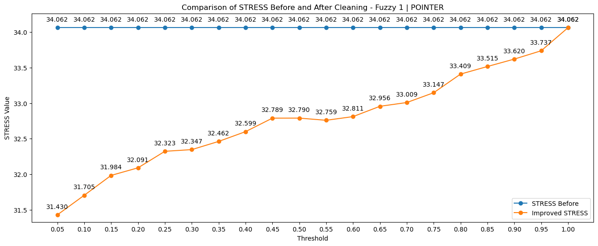

# Consistency analysis of color difference databases.

## Author
- Daniel Arranz Ortega

## Tutors
- [Pedro Latorre Carmona](https://scholar.google.com/citations?user=3Rm-8d8AAAAJ&hl=en)
- [Samuel Morillas Gómez](https://viplab.webs.upv.es/)
- [Rafael Huertas Roa](https://scholar.google.es/citations?user=tyJqxDEAAAAJ&hl=en)

## Summary of Work
This Master's Thesis (TFM) focuses on addressing the importance of accurately measuring and comparing colors in various fields, such as industry, textiles, agriculture and medicine. The ability to accurately assess color is essential to ensure consistency in production and to detect subtle changes in color that may have health implications.
The main objective of this TFM is to perform an in-depth analysis on color measurement and comparison, leveraging large-scale data analysis techniques, in a Big Data context. This involves carrying out a thorough review of the existing literature in this field to contextualize the research and detect knowledge gaps. In addition, a methodology will be implemented that relies on the detection of discrepancies between visually perceived color differences and color differences calculated from color coordinates. Various tolerance thresholds will be explored to evaluate their impact on inconsistency detection. The analysis is strengthened by incorporating an assessment of inconsistency, using the metric known as "Standardized Residual Sum of Squares" (STRESS).
The end result of this work will be the identification, analysis and elimination of inconsistent color pairs in color difference databases. This data cleaning will significantly contribute to improving the quality of the databases in question, which will have a positive impact on a wide range of applications where color accuracy plays a critical role.

## Summary of results

These scripts provide a valuable tool for automating the analysis of large databases for inconsistencies and the visualization of STRESS metrics for Fuzzy1 and Fuzzy2 rules. 

In this graph, we can see how the STRESS value improves as inconsistent data is removed from the database using Fuzzy Rule 1. The lower the STRESS value, the greater the improvement in database consistency. When the threshold is very low, a lot of inconsistent data is removed, resulting in a significant improvement in STRESS. However, as we increase the threshold, the number of inconsistent pairs removed decreases to the same value that the database had in its original state.

Thanks to this automation, the process of detecting inconsistent data in large data sets is streamlined, saving time and resources. In addition, visualization of metrics such as STRESS provides a deeper understanding of data quality and how it varies depending on the data quality. 

## How to reproduce the results:
To reproduce the MATLAB script that generates a set of inconsistent pairs and the output data (DatosOut), you should first configure the database by loading it as a 10xN variable in MATLAB and assigning its corresponding values to the variables databaseName and DatosIn. Next, proceed with setting up the Fuzzy rule you intend to use in the FuzzyRule variable and specify the threshold values according to your specific requirements. Use these parameters to generate the inconsistent pairs from your database and the configured Fuzzy logic. This will generate a results folder with a set of CSV files for later use.

The MATLAB script requires the InconsistenciesFuzzyRule1 and InconsistenciesFuzzyRule2 scripts to be loaded, which can be obtained from https://viplab.webs.upv.es/DESCARGAS%20VIPLAB/Josa2016.rar. 
Continuing with the process, to process the obtained data with Python, you only need to provide the absolute paths to the directories of each of the results folders.

Please note that these steps will adapt to the configurations you have previously used in MATLAB and Python. Ensure that libraries and paths are correctly configured so that you can work with the results generated in MATLAB within your Python environment.

Make sure you have Python installed on your computer, and if necessary, install the specific libraries that may be required to run the scripts. https://www.python.org/downloads/

## References
- Morillas S, Gómez-Robledo L, Huertas R, Melgosa M. Method to determine the degrees of consistency in experimental datasets of perceptual color differences. Journal of the Optical Society of America A. 2016;33(12). 

- Morillas S, Gomez-Robledo L, Huertas R, Melgosa M. Fuzzy analysis for detection of inconsistent data in experimental datasets employed at the development of the CIEDE2000 colour-difference formula. J Mod Opt. 2009;56(13). 

- Latorre-Carmona P, Huertas R, Pedersen M, Morillas S. Proposal of a new fidelity measure between computed image quality and observers quality scores accounting for scores variability. J Vis Commun Image Represent. 2023;90.

- García PA, Huertas R, Melgosa M, Cui G. Measurement of the relationship between perceived and computed color differences. Journal of the Optical Society of America A. 2007;24(7). 

